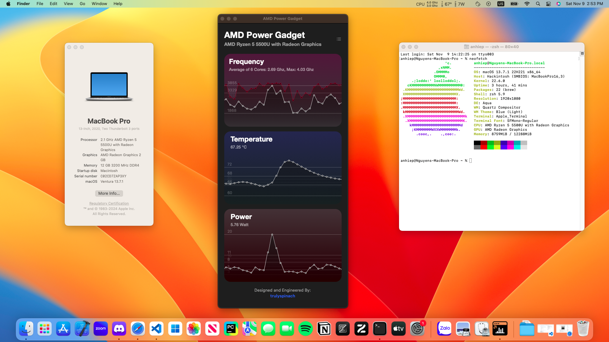

<h1 align="center">Hackintosh the Dell Inspiron 5515</h1>

    
    
    

    

# Overview
**I am not responsible for any damages you may cause.**

**If my work here helped you. Please consider donating, it would mean a lot to me.**

- I will try my best to keep the EFI updated with OpenCore, Kext, NootedRed, ...
- This EFI is configured with MacOs Ventura, I currently can't manage to update to Sonoma

# Laptop Specification
- **Processor:** AMD Ryzen 5 5500U 2.1 GHz 

- **Ram:** 12 GB (dual channel, with [8gb Kingston Ram](https://memoryzone.com.vn/ram-laptop-kingston-ddr4-8gb-bus-3200mhz-kvr32s22s8-8) replaced for one broken 4gb ram)

- **SSD:** NVMe KIOXIA 256GB Media

- **Display:** 15.6" Full HD (1920 x 1080) with touch

- **Video Cardy**:
    - iGPU: AMD vega 7
    - dGPU: this laptop comes with no dGPU

# Summary

  
What works

   

  | Feature                              | Status | Dependency                                                     |
  | ------------------------------------ | ------ | -------------------------------------------------------------- |
  | Touch Screen                         | ✅     | Latest VoodooI2C.kext, VoodooHID.kext                          |
  | Keyboard                             | ✅     | Latest VoodooI2C.kext, VoodooPS2.kext                          |
  | Backlight (brightness control)       | ✅     | Latest NootedRed.kext, SSDT-PNLF.aml from [chefkissinc](https://chefkissinc.github.io/applehax/nootedred/) |

  
What <strong>not</strong> works

   

  | Feature                              | Status | Dependency                                                     |
  | ------------------------------------ | ------ | -------------------------------------------------------------- |
  | Air Drop/ Handoff                    | ❌     | Broadcom BlueTooth card                                        |
  | Finger Print                         | ❌     | Requires Apple M2 Chip (I don't know why)                       |

